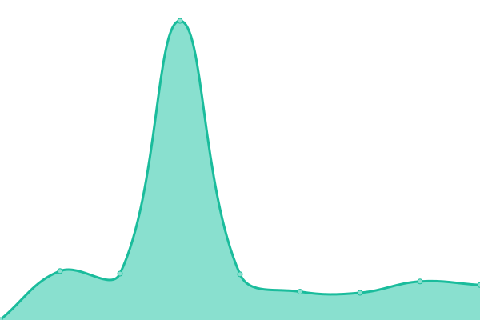

# [📈 Live Status](https://DFE-Digital.github.io/schools-commerical-team-upptime): <!--live status--> **🟩 All systems operational**

This repository contains the open-source uptime monitor and status page for [Department for Education - Digital](http://education.gov.uk/), powered by [Upptime](https://github.com/upptime/upptime).

With [Upptime](https://upptime.js.org), you can get your own unlimited and free uptime monitor and status page, powered entirely by a GitHub repository. We use [Issues](https://github.com/DFE-Digital/schools-commerical-team-upptime/issues) as incident reports, [Actions](https://github.com/DFE-Digital/schools-commerical-team-upptime/actions) as uptime monitors, and [Pages](https://DFE-Digital.github.io/schools-commerical-team-upptime) for the status page.

<!--start: status pages-->
<!-- This summary is generated by Upptime (https://github.com/upptime/upptime) -->
<!-- Do not edit this manually, your changes will be overwritten -->
<!-- prettier-ignore -->
| URL | Status | History | Response Time | Uptime |
| --- | ------ | ------- | ------------- | ------ |
|  [GHBS Staging](https://staging-get-help-buying-for-schools.education.gov.uk/) | 🟩 Up | [ghbs-staging.yml](https://github.com/DFE-Digital/schools-commerical-team-upptime/commits/HEAD/history/ghbs-staging.yml) | 

 790ms
     
 | 

<a href="https://DFE-Digital.github.io/schools-commerical-team-upptime/history/ghbs-staging">100.00%</a>
    

|  [GHBS Production](https://www.get-help-buying-for-schools.service.gov.uk/) | 🟩 Up | [ghbs-production.yml](https://github.com/DFE-Digital/schools-commerical-team-upptime/commits/HEAD/history/ghbs-production.yml) | 

 837ms
     
 | 

<a href="https://DFE-Digital.github.io/schools-commerical-team-upptime/history/ghbs-production">100.00%</a>
    

|  [FaF Production](https://find-dfe-approved-framework.service.gov.uk/find/type) | 🟩 Up | [fa-f-production.yml](https://github.com/DFE-Digital/schools-commerical-team-upptime/commits/HEAD/history/fa-f-production.yml) | 

 618ms
     
 | 

<a href="https://DFE-Digital.github.io/schools-commerical-team-upptime/history/fa-f-production">100.00%</a>
    

|  [FaF Production - List page](https://find-dfe-approved-framework.service.gov.uk/list) | 🟩 Up | [fa-f-production-list-page.yml](https://github.com/DFE-Digital/schools-commerical-team-upptime/commits/HEAD/history/fa-f-production-list-page.yml) | 

 255ms
     
 | 

<a href="https://DFE-Digital.github.io/schools-commerical-team-upptime/history/fa-f-production-list-page">100.00%</a>
    

<!--end: status pages-->

[**Visit our status website →**](https://DFE-Digital.github.io/schools-commerical-team-upptime)

## 📄 License

- Powered by: [Upptime](https://github.com/upptime/upptime)
- Code: [MIT](./LICENSE) © [Department for Education - Digital](http://education.gov.uk/)
- Data in the `./history` directory: [Open Database License](https://opendatacommons.org/licenses/odbl/1-0/)
